<div align="center"><a name="readme-top"></a>

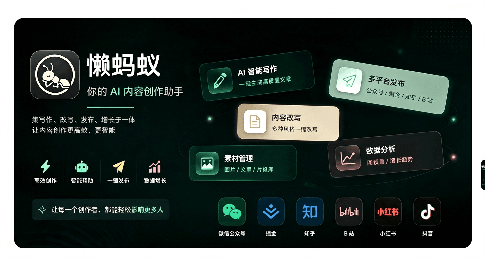

<br />

**Skill 驱动写作 · 文章与图文 · 多平台发布**

<br />

让外部 AI 负责生成，懒蚂蚁负责整理、排版与发布。<br />
文章、图文、主题、Skill、账号与发布，都在同一个桌面工作区完成。

<br />

[下载安装包][download-link] · [更新日志][changelog-link] · [MCP 文档][mcp-doc-link]

<br />

[![Release][release-shield]][download-link]
[![Platform][platform-shield]](#下载)
[![Stars][stars-shield]][stars-link]
[![License][license-shield]](#免责声明)

</div>

<details>
<summary><kbd>目录</kbd></summary>

- [应用截图](#应用截图)
- [下载](#下载)
- [功能一览](#功能一览)
- [内容工作流](#内容工作流)
- [快速上手](#快速上手)
- [MCP 接入](#mcp-接入cursor--codex--workbuddy)
- [支持的平台](#支持的平台)
- [安装说明](#安装说明)
- [免责声明](#免责声明)

</details>

## 应用截图

### 文章与图文

<table>
  <tr>
    <td width="50%" align="center" valign="top">
      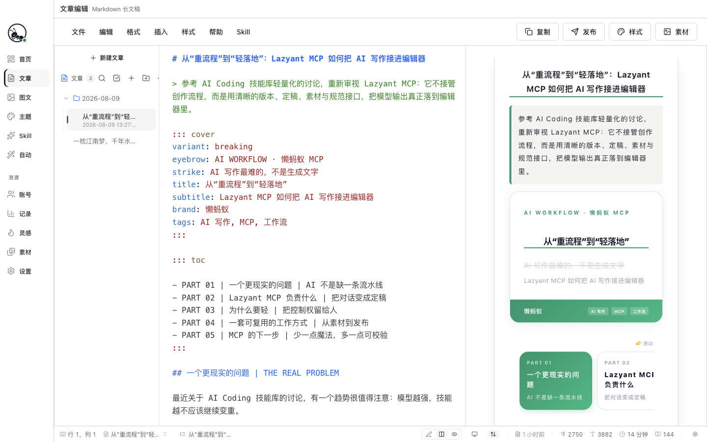
      <br /><sub>文章编辑 · Markdown 长文实时预览</sub>
    </td>
    <td width="50%" align="center" valign="top">
      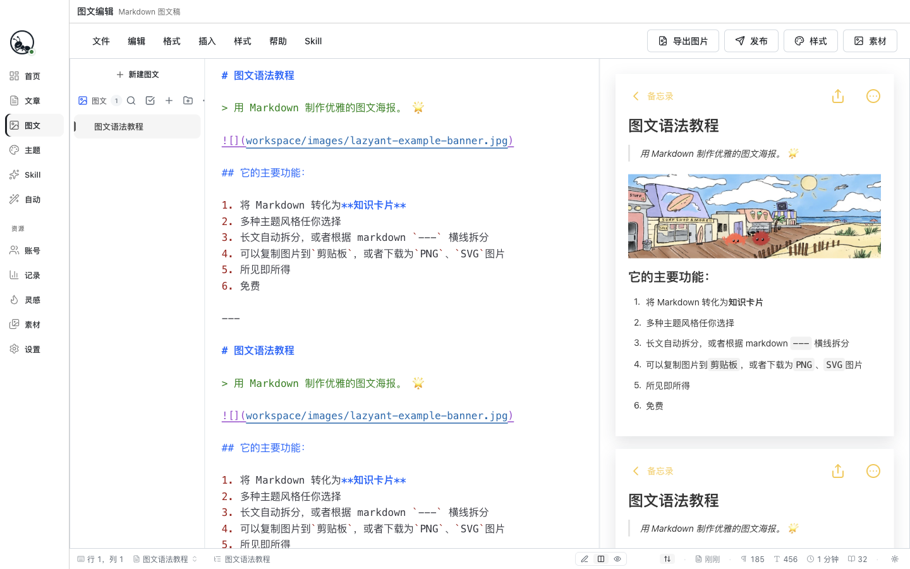
      <br /><sub>图文编辑 · 分卡排版与机型预览</sub>
    </td>
  </tr>
</table>

<div align="right">

[![回到顶部][back-to-top]](#readme-top)

</div>

### 首页工作台

<div align="center">
  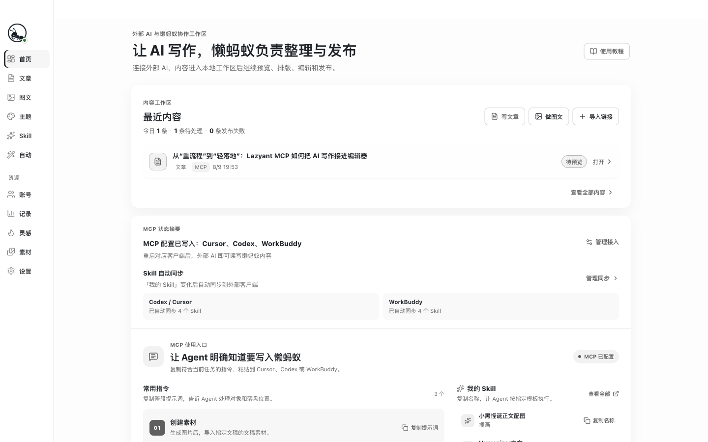
  <br /><sub>首页：MCP 状态、常用指令、我的 Skill 与最近内容</sub>
</div>

<div align="right">

[![回到顶部][back-to-top]](#readme-top)

</div>

### 主题库

<div align="center">
  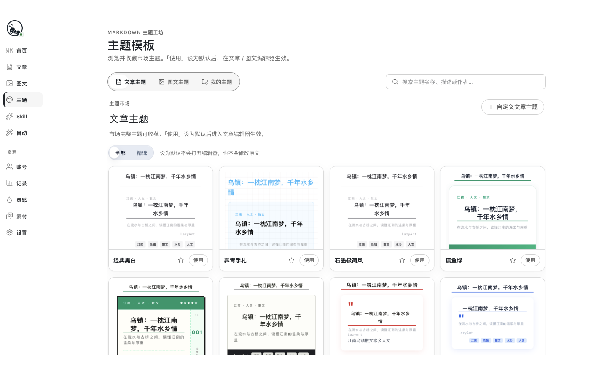
  <br /><sub>文章主题与图文主题统一浏览、收藏和套用</sub>
</div>

<br />

<p align="center"><strong>文章主题</strong></p>

<table>
  <tr>
    <td width="33%" align="center" valign="top">
      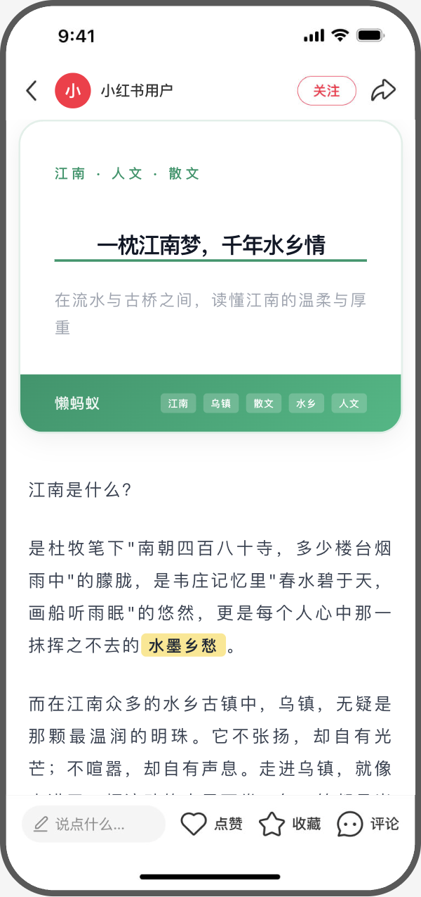
      <br /><sub>摸鱼绿</sub>
    </td>
    <td width="33%" align="center" valign="top">
      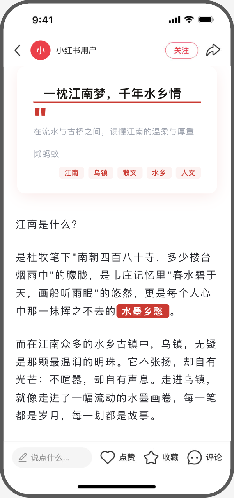
      <br /><sub>红白色系</sub>
    </td>
    <td width="33%" align="center" valign="top">
      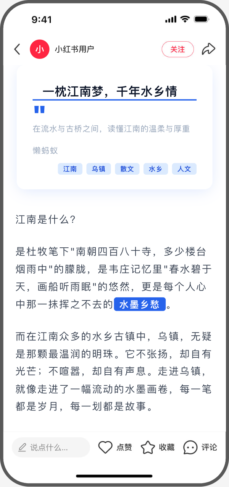
      <br /><sub>晴川云影</sub>
    </td>
  </tr>
</table>

<br />

<p align="center"><strong>图文主题 · 小红书预览模式</strong></p>

<div align="center">
  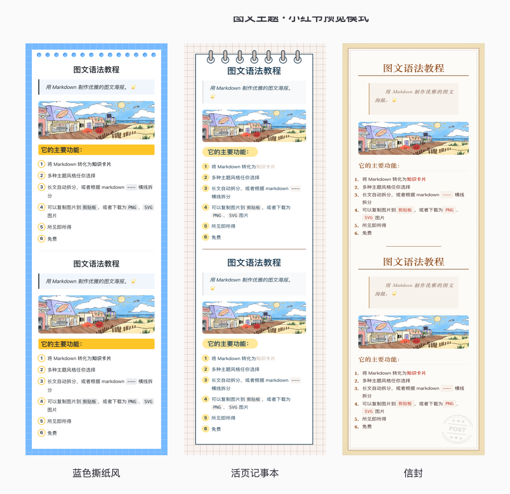
  <br /><sub>蓝色撕纸风 · 活页记事本 · 信封</sub>
</div>

<div align="right">

[![回到顶部][back-to-top]](#readme-top)

</div>

### 创作、灵感与发布

<table>
  <tr>
    <td width="50%" align="center" valign="top">
      
      <br /><sub>Skill 模板</sub>
    </td>
    <td width="50%" align="center" valign="top">
      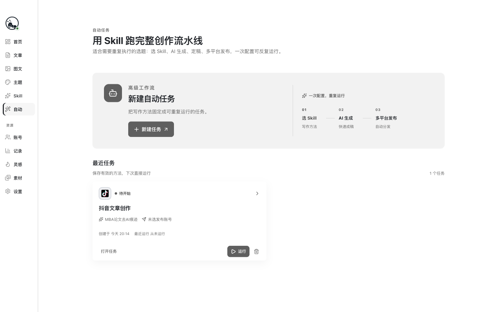
      <br /><sub>自动化任务</sub>
    </td>
  </tr>
  <tr>
    <td width="50%" align="center" valign="top">
      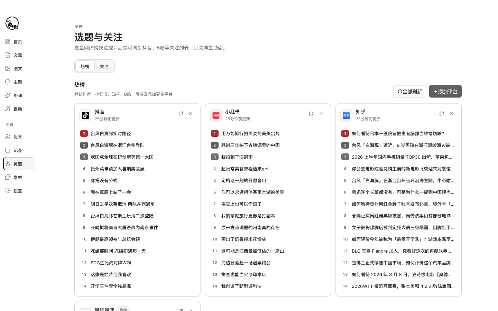
      <br /><sub>灵感热榜</sub>
    </td>
    <td width="50%" align="center" valign="top">
      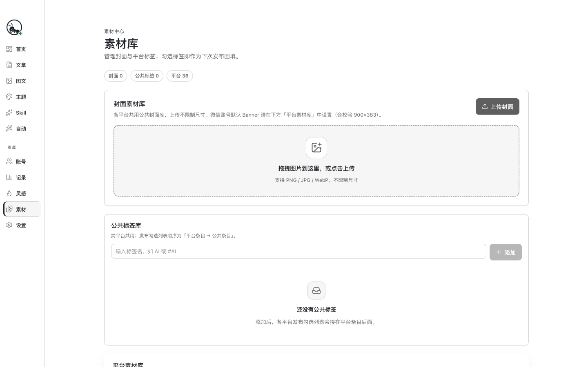
      <br /><sub>素材库</sub>
    </td>
  </tr>
  <tr>
    <td width="50%" align="center" valign="top">
      
      <br /><sub>账号管理</sub>
    </td>
    <td width="50%" align="center" valign="top">
      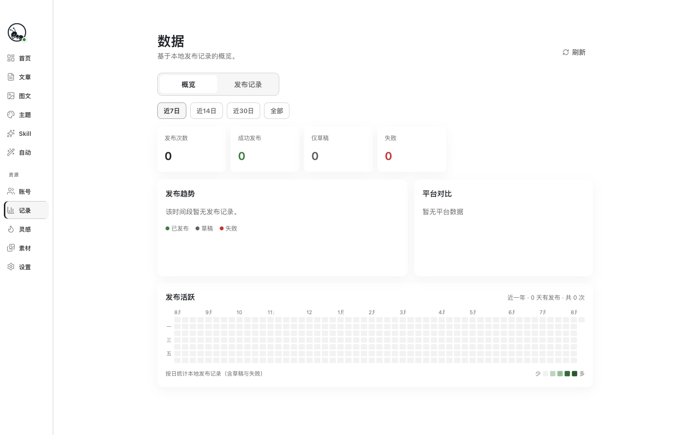
      <br /><sub>发布记录</sub>
    </td>
  </tr>
</table>

<div align="right">

[![回到顶部][back-to-top]](#readme-top)

</div>

## 下载

| 系统        | 架构                    | 安装包                    | 下载                                                                                                |
| :---------- | :---------------------- | :------------------------ | :-------------------------------------------------------------------------------------------------- |
| **macOS**   | Apple Silicon（M 系列） | `懒蚂蚁-1.4.7-arm64.dmg`  | [**下载**](https://github.com/rokiai/lazy-ant-app/releases/latest/download/懒蚂蚁-1.4.7-arm64.dmg)  |
| **macOS**   | Intel                   | `懒蚂蚁-1.4.7-x64.dmg`    | [**下载**](https://github.com/rokiai/lazy-ant-app/releases/latest/download/懒蚂蚁-1.4.7-x64.dmg)    |
| **Windows** | 64 位                   | `懒蚂蚁-1.4.7-setup.exe`  | [**下载**](https://github.com/rokiai/lazy-ant-app/releases/latest/download/懒蚂蚁-1.4.7-setup.exe)  |
| **Linux**   | 64 位                   | `懒蚂蚁-1.4.7.AppImage`   | [**下载**](https://github.com/rokiai/lazy-ant-app/releases/latest/download/懒蚂蚁-1.4.7.AppImage)   |
| **Linux**   | Debian / Ubuntu         | `lazyant-1.4.7_amd64.deb` | [**下载**](https://github.com/rokiai/lazy-ant-app/releases/latest/download/lazyant-1.4.7_amd64.deb) |

> 链接指向最新 Release。macOS 安装包尚未签名，若提示「无法验证开发者」见 [安装说明](#安装说明)。

<div align="right">

[![回到顶部][back-to-top]](#readme-top)

</div>

## 功能一览

懒蚂蚁把「生成、整理、排版、预览、发布」放在同一个桌面工作区。你可以从首页进入文章或图文编辑，也可以让外部 AI 通过 MCP 直接写入草稿，再回到应用完成主题排版和发布准备。

| 能力           | 说明                                                                 |
| :------------- | :------------------------------------------------------------------- |
| **首页工作台** | 查看最近内容、MCP 连接状态、常用指令和我的 Skill，快速进入下一步操作 |
| **文章编辑**   | Markdown 长文稿，支持封面、导读、目录、PART 分章、强调和文末互动组件 |
| **图文编辑**   | 用 Markdown 分卡，实时查看多卡预览，导出 PNG 并准备平台图文草稿      |
| **主题库**     | 文章主题与图文主题统一浏览、收藏和套用，个人主题可持续维护           |
| **Skill 模板** | 把写作方法、改写结构和平台规范沉淀为可复用的提示词模板               |
| **自动化**     | 选择 Skill、输入素材和目标平台，生成内容并串联后续任务               |
| **灵感与素材** | 聚合选题灵感，管理图片、文章和发布时需要的本地素材                   |
| **账号管理**   | 统一维护平台登录态、公众号资料和写作模型接口                         |
| **发布记录**   | 回看同步结果、任务状态和历史发布记录                                 |
| **MCP 接入**   | 让 Cursor、Codex、WorkBuddy 等外部 AI 读写文章、图文、Skill 与主题   |

<div align="right">

[![回到顶部][back-to-top]](#readme-top)

</div>

## 内容工作流

1. **准备内容**：在首页新建文章 / 图文，或让外部 AI 通过 MCP 写入草稿。
2. **完成排版**：在编辑器中修改 Markdown，切换文章主题或图文主题，检查封面、目录和分卡结果。
3. **确认预览**：使用桌面预览或小红书机型预览，确认标题、正文、图片和平台字段。
4. **同步发布**：选择已登录账号，保存平台草稿；需要重复执行的内容可以交给自动化任务。

文章适合长文、公众号稿件和技术内容；图文适合小红书笔记、知识卡片和多图海报。两种内容共用本地工作区、主题库、素材库和发布账号。

<div align="right">

[![回到顶部][back-to-top]](#readme-top)

</div>

## 快速上手

1. 打开应用，在「账号」里添加目标平台并完成登录
2. 在「设置」中配置写作模型和平台传输方式
3. 从首页进入「文章」或「图文」，选主题、写内容、预览定稿
4. 点击「发布」，按账号需要补充封面、摘要、话题等平台字段后保存草稿
5. 在「自动」中选择 Skill 和任务参数，配置可重复执行的内容流程
6. （可选）在首页按引导连接 Cursor、Codex 或 WorkBuddy，让外部 AI 直接写入内容

<div align="right">

[![回到顶部][back-to-top]](#readme-top)

</div>

## MCP 接入（Cursor / Codex / WorkBuddy）

懒蚂蚁自带 **MCP Server**，让 [Cursor](https://cursor.com)、[OpenAI Codex](https://developers.openai.com/codex)、WorkBuddy 等外部 AI 客户端直接读写本地的文章、图文、Skill 与个人主题——与桌面端共用同一份数据，写完可在懒蚂蚁里预览、排版、发布。

### 能做什么

| 能力         | 新建 | 修改 | MCP 入口                                                                                                                           |
| :----------- | :--: | :--: | :--------------------------------------------------------------------------------------------------------------------------------- |
| **规范**     |  —   |  —   | **Prompt** `写文章` 等（推荐）；或 Resource / `get_*_spec`                                                                         |
| **文章**     |  ✅  |  ✅  | `get_article_draft` / `create_article_draft` / `update_article_draft`                                                              |
| **图文**     |  ✅  |  ✅  | `get_image_text_draft` / `create_image_text_draft` / `update_image_text_draft`（`---` 分卡，至少 4 张卡）                          |
| **Skill**    |  ✅  |  ✅  | `search_workspace_skills` / `get_workspace_skill` / `create_workspace_skill` / `update_workspace_skill` / `delete_workspace_skill` |
| **文章主题** |  ✅  |  ✅  | `search_article_themes` / `get_article_theme` / `create_article_theme` / `update_article_theme`                                    |
| **图文主题** |  ✅  |  ✅  | `search_image_themes` / `get_image_theme` / `create_image_theme` / `update_image_theme`                                            |

说明：

- 文章与图文定稿写入 `workspace/articles/article-ready.json`，打开懒蚂蚁编辑器即可看到。
- **写前先读规范**：优先用 MCP Prompt `写文章` 等；或 `get_*_spec` / Resource `lazyant://spec/...`。
- 个人主题写入 `workspace/themes/`，会自动同步到「我的主题」；市场内置主题可浏览读取，修改仅针对个人主题。
- 平台发布、登录态检测等不通过 MCP 暴露。

### 配置步骤（推荐：已安装懒蚂蚁）

1. 打开懒蚂蚁首页，点击 Cursor、Codex 或 WorkBuddy 打开对应教程
2. macOS / Windows 点击 **「一键配置」**；Linux 点击 **「复制 MCP 配置」** 后手动写入（Linux 暂不支持一键配置）
3. 重启客户端，确认「懒蚂蚁」服务已连接

#### Cursor

Cursor 全局配置文件为 `~/.cursor/mcp.json`（Windows 为 `%USERPROFILE%\\.cursor\\mcp.json`）。一键配置会增量保留其他 MCP 服务。

macOS 安装包示例（路径以你复制的内容为准）：

```json
{
  "mcpServers": {
    "lazyant": {
      "type": "stdio",
      "command": "/Applications/懒蚂蚁.app/Contents/Resources/lazyant-mcp",
      "args": [],
      "env": {
        "LAZYANT_DATA_DIR": "/Users/你的用户名/Library/Application Support/懒蚂蚁"
      }
    }
  }
}
```

Windows 启动器为 `Resources\lazyant-mcp.cmd`；Linux 仅提供复制内容，启动器路径需手动确认。无需单独安装 Node / pnpm。

#### OpenAI Codex

Codex 使用 TOML，不是 JSON。在首页打开 Codex 教程后配置到：

- 用户级：`~/.codex/config.toml`（全局生效；Windows 为 `%USERPROFILE%\\.codex\\config.toml`）

一键配置只替换 `[mcp_servers.lazyant]`，保留其他配置。

macOS 安装包示例：

```toml
[mcp_servers.lazyant]
command = "/Applications/懒蚂蚁.app/Contents/Resources/lazyant-mcp"
args = []

[mcp_servers.lazyant.env]
LAZYANT_DATA_DIR = "/Users/你的用户名/Library/Application Support/懒蚂蚁"
```

也可用 Codex CLI 注册：

```bash
codex mcp add lazyant -- /Applications/懒蚂蚁.app/Contents/Resources/lazyant-mcp
```

若 CLI 未写入 `LAZYANT_DATA_DIR`，请在 `config.toml` 的 `[mcp_servers.lazyant.env]` 中手动补上。

### 从源码开发时

在仓库根目录（开发专用，需本机已装 pnpm）：

```bash
LAZYANT_DATA_DIR="$HOME/Library/Application Support/懒蚂蚁" \
  pnpm --filter @lazy-ant/desktop cli:mcp
```

**Cursor**（`.cursor/mcp.json`，开发态）：

```json
{
  "mcpServers": {
    "lazyant": {
      "type": "stdio",
      "command": "pnpm",
      "args": ["--dir", "/你的路径/lazy-ant/apps/desktop", "cli:mcp"],
      "env": {
        "LAZYANT_DATA_DIR": "/Users/你的用户名/Library/Application Support/懒蚂蚁"
      }
    }
  }
}
```

**Codex**（`~/.codex/config.toml`，开发态）：

```toml
[mcp_servers.lazyant]
command = "pnpm"
args = ["--dir", "/你的路径/lazy-ant/apps/desktop", "cli:mcp"]

[mcp_servers.lazyant.env]
LAZYANT_DATA_DIR = "/Users/你的用户名/Library/Application Support/懒蚂蚁"
```

### 使用示例

在 Cursor / Codex 里可以让 AI 调用工具，例如：

- 「用 `create_article_draft` 写一篇关于懒蚂蚁的公众号稿」
- 「读取当前图文定稿，把第三张卡改短一点再保存」
- 「新建一个 Skill，SKILL.md 里写小红书种草笔记结构」
- 「基于摸鱼绿主题风格，生成一套个人文章主题 CSS 并保存」

保存图文时，`content` 须用独立行的 `---` 分隔卡片，至少 4 张卡，`tags` 恰好 3 个话题（不要加 `#`）：

```json
{
  "title": "笔记标题",
  "digest": "八十到一百字摘要",
  "content": "开头钩子\n\n---\n\n经历分享\n\n---\n\n三个方法\n\n---\n\n结尾提问",
  "tags": ["效率工具", "职场干货", "个人成长"]
}
```

更完整的工具说明与数据路径见 [MCP Server 文档][mcp-doc-link]。

<div align="right">

[![回到顶部][back-to-top]](#readme-top)

</div>

## 支持的平台

公众号 · 掘金 · 知乎 · CSDN · 简书 · SegmentFault · 博客园 · 语雀 · 百家号 · B 站 · 微博 · 小红书 · 今日头条 · 开源中国 · 51CTO · 搜狐号 · 雪球 · 豆瓣 · 东方财富 · 慕课手记 · 人人都是产品经理

不同平台支持的内容形态和传输方式不同：文章、图文、草稿同步与正式发布以应用内账号面板显示为准；未登录或未开放权限的平台不会被强行同步。

<div align="right">

[![回到顶部][back-to-top]](#readme-top)

</div>

## 安装说明

### macOS

1. 按芯片下载对应 DMG：[Apple Silicon](https://github.com/rokiai/lazy-ant-app/releases/latest/download/懒蚂蚁-1.4.7-arm64.dmg) · [Intel](https://github.com/rokiai/lazy-ant-app/releases/latest/download/懒蚂蚁-1.4.7-x64.dmg)
2. 打开 DMG，把 **懒蚂蚁** 拖进「应用程序」
3. 从「应用程序」启动

若提示「已损坏，无法打开」，在终端执行：

```bash
xattr -cr /Applications/懒蚂蚁.app
open /Applications/懒蚂蚁.app
```

若提示「无法验证开发者」：右键 App →「打开」→ 再点「打开」；或在「系统设置 → 隐私与安全性」中点「仍要打开」。

### Windows

1. 运行 [懒蚂蚁-1.4.7-setup.exe](https://github.com/rokiai/lazy-ant-app/releases/latest/download/懒蚂蚁-1.4.7-setup.exe)
2. 若出现 SmartScreen：点「更多信息」→「仍要运行」

### Linux

- **AppImage**：`chmod +x 懒蚂蚁-1.4.7.AppImage && ./懒蚂蚁-1.4.7.AppImage`（[下载](https://github.com/rokiai/lazy-ant-app/releases/latest/download/懒蚂蚁-1.4.7.AppImage)）
- **deb**：`sudo dpkg -i lazyant-1.4.7_amd64.deb`（[下载](https://github.com/rokiai/lazy-ant-app/releases/latest/download/lazyant-1.4.7_amd64.deb)，缺依赖时再 `sudo apt -f install`）

<div align="right">

[![回到顶部][back-to-top]](#readme-top)

</div>

## 免责声明

懒蚂蚁源码与安装包**仅供学习、研究与技术交流**，由开发者**免费提供**，不收取软件使用费。你可在遵守本声明及相关开源协议的前提下阅读、本地运行与二次开发；**不得**将本软件或其修改版用于商业销售、收费分发、代运营转售、捆绑售卖等营利行为，亦不得冒用本项目名义收费或提供付费「官方」服务（除非获得权利人书面授权）。

懒蚂蚁仍处于快速迭代阶段，按「现状」提供，不构成任何明示或默示的保证。使用前请知悉并自行承担相关风险：

1. **开源与学习用途**：本仓库旨在分享桌面端内容工具的实现思路，不承诺长期维护、技术支持或功能完备。Fork、借鉴请自行评估合规性与维护成本；市场内置 Skill、主题等资源可能含第三方或上游许可，二次分发时请一并遵守其版权与许可条款。
2. **软件稳定性**：功能、界面、数据格式可能随版本更新发生变化；请勿将本软件作为唯一或关键业务数据的唯一存储与备份手段，重要内容请自行留存副本。
3. **AI 生成内容**：助手、Skill、自动化等能力依赖第三方大模型，生成结果可能存在事实错误、偏见或不适用场景。发布前请自行审核内容的准确性、合法性与合规性；因使用 AI 产出内容引发的纠纷或损失，由使用者自行负责。
4. **平台发布与账号**：本软件与各内容平台无官方关联；平台名称、标识等归各自权利人所有。同步草稿、自动发布等能力依赖各平台页面与接口，可能因平台规则调整、风控、登录态失效而失败或受限。请遵守各平台服务条款与社区规范；因违规使用导致的限流、封禁或其他后果，由使用者自行承担。
5. **数据与凭证**：账号登录态、API Key、本地文稿等数据主要保存在你的设备上。请妥善保管设备与密钥，勿在不可信环境使用；因泄露、误操作或第三方服务中断造成的损失，开发者不承担赔偿责任。
6. **责任限制**：在适用法律允许的最大范围内，开发者不对因使用或无法使用本软件而产生的任何直接、间接、附带或后果性损害承担责任。

继续使用、下载或基于本仓库进行二次开发，即表示你已阅读并理解上述条款。若不同意，请停止使用并卸载本软件。

<!-- LINK GROUP -->

[back-to-top]: https://img.shields.io/badge/-回到顶部-151515?style=flat-square
[changelog-link]: ./CHANGELOG.md
[download-link]: https://github.com/rokiai/lazy-ant-app/releases/latest
[license-shield]: https://img.shields.io/badge/用途-学习研究-lightgrey?style=flat-square
[mcp-doc-link]: ./docs/MCP-Server.md
[platform-shield]: https://img.shields.io/badge/平台-macOS%20%7C%20Windows%20%7C%20Linux-blue?style=flat-square
[release-shield]: https://img.shields.io/github/v/release/rokiai/lazy-ant-app?style=flat-square&label=Release
[stars-link]: https://github.com/rokiai/lazy-ant-app/stargazers
[stars-shield]: https://img.shields.io/github/stars/rokiai/lazy-ant-app?style=flat-square&label=Stars
