<div align="center">


# 懒蚂蚁 · LazyAnt

**Skill 驱动写作 · 文章与图文 · 多平台发布**

macOS · Windows · Linux

<br />

[**下载安装包**](https://github.com/rokiai/lazy-ant-app/releases/latest) · [**更新日志**](./CHANGELOG.md)

</div>

## 下载

| 系统        | 架构                    | 安装包              | 下载                                                                                          |
| :---------- | :---------------------- | :------------------ | :-------------------------------------------------------------------------------------------- |
| **macOS**   | Apple Silicon（M 系列） | `LazyAnt-arm64.dmg` | [**下载**](https://github.com/rokiai/lazy-ant-app/releases/latest/download/LazyAnt-arm64.dmg) |
| **macOS**   | Intel                   | `LazyAnt-x64.dmg`   | [**下载**](https://github.com/rokiai/lazy-ant-app/releases/latest/download/LazyAnt-x64.dmg)   |
| **Windows** | 64 位                   | `LazyAnt-setup.exe` | [**下载**](https://github.com/rokiai/lazy-ant-app/releases/latest/download/LazyAnt-setup.exe) |
| **Linux**   | 64 位                   | `LazyAnt.AppImage`  | [**下载**](https://github.com/rokiai/lazy-ant-app/releases/latest/download/LazyAnt.AppImage)  |
| **Linux**   | Debian / Ubuntu         | `lazyant_amd64.deb` | [**下载**](https://github.com/rokiai/lazy-ant-app/releases/latest/download/lazyant_amd64.deb) |

> 链接指向最新 Release。macOS 安装包尚未签名，若提示「无法验证开发者」见文末 [安装说明](#安装说明)。

## 界面截图

<div align="center">
  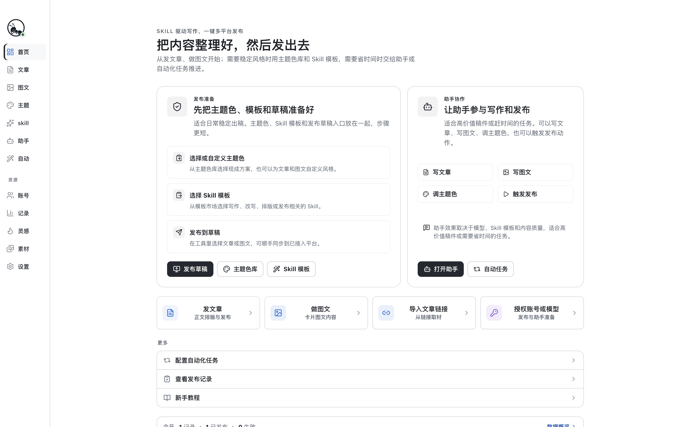
  <br /><sub>控制台</sub>
</div>

<br />

<table>
  <tr>
    <td width="50%" align="center">
      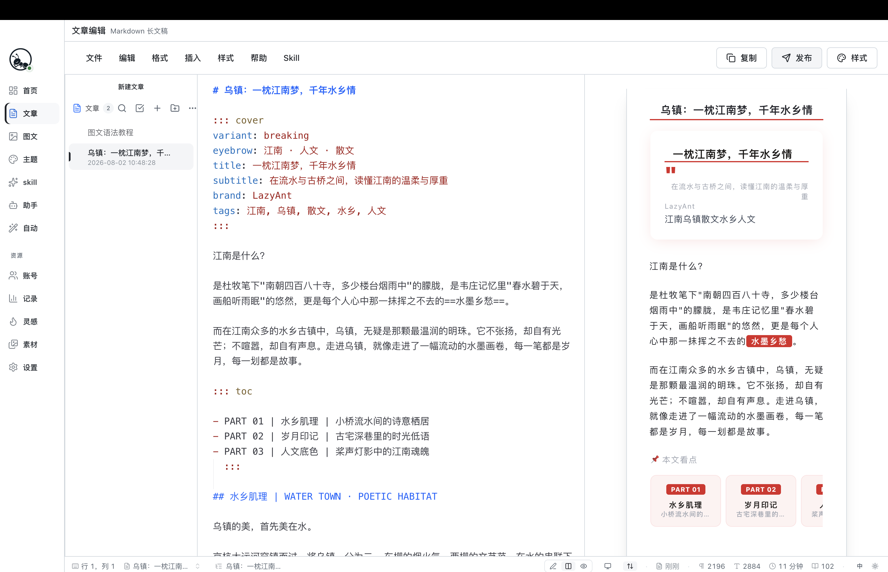
      <br /><sub>文章编辑</sub>
    </td>
    <td width="50%" align="center">
      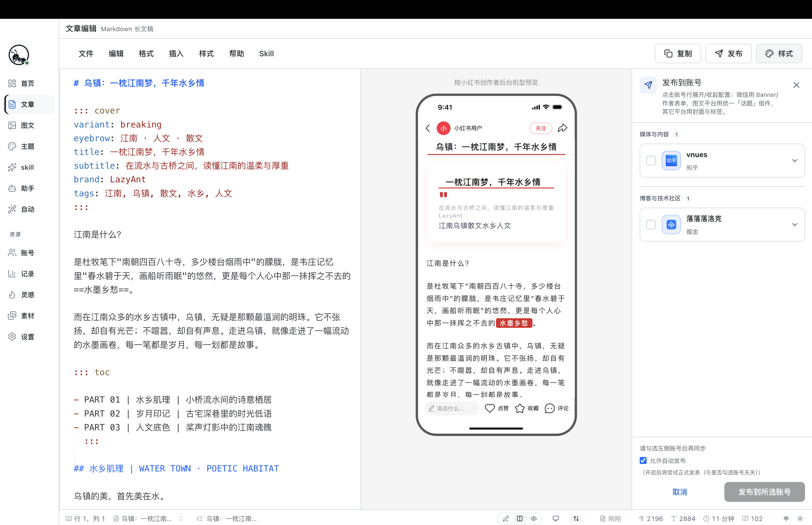
      <br /><sub>文章发布</sub>
    </td>
  </tr>
</table>

<br />

<div align="center">
  
  <br /><sub>图文编辑</sub>
</div>

<br />

<div align="center">
  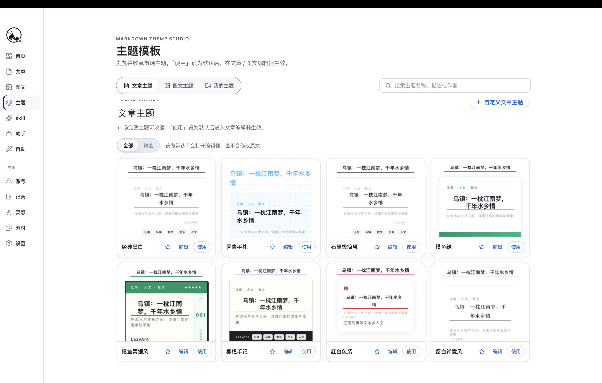
  <br /><sub>文章主题</sub>
</div>

<br />

<table>
  <tr>
    <td width="33%" align="center">
      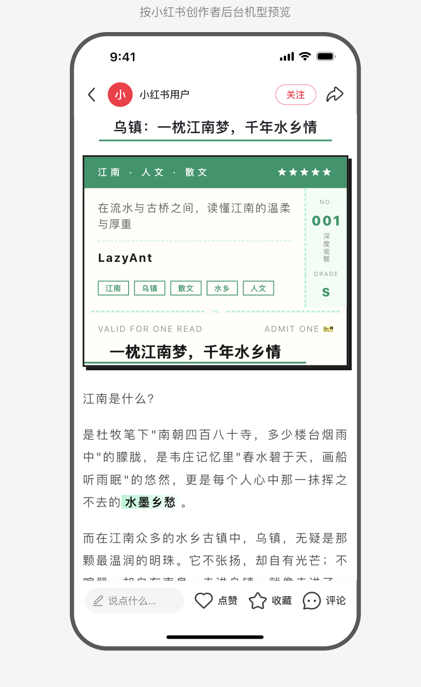
    </td>
    <td width="33%" align="center">
      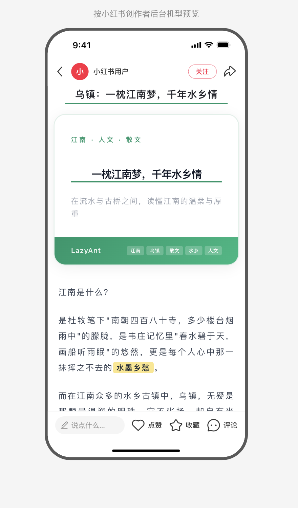
    </td>
    <td width="33%" align="center">
      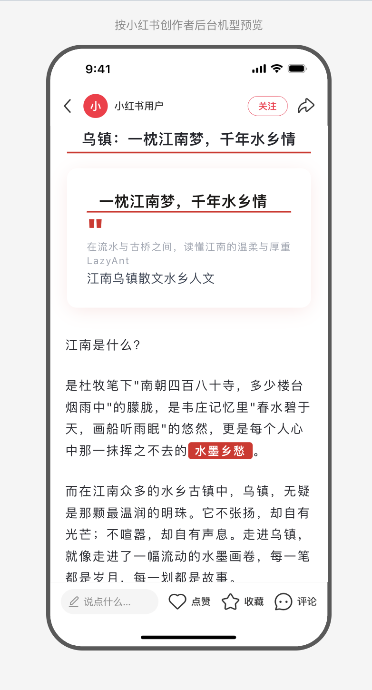
    </td>
  </tr>
</table>

<br />

<div align="center">
  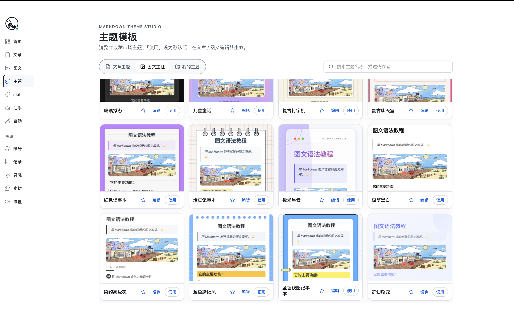
  <br /><sub>图文主题</sub>
</div>

<br />

<table>
  <tr>
    <td width="33%" align="center">
      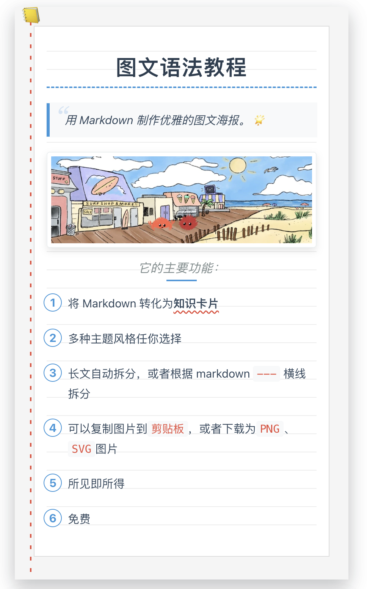
    </td>
    <td width="33%" align="center">
      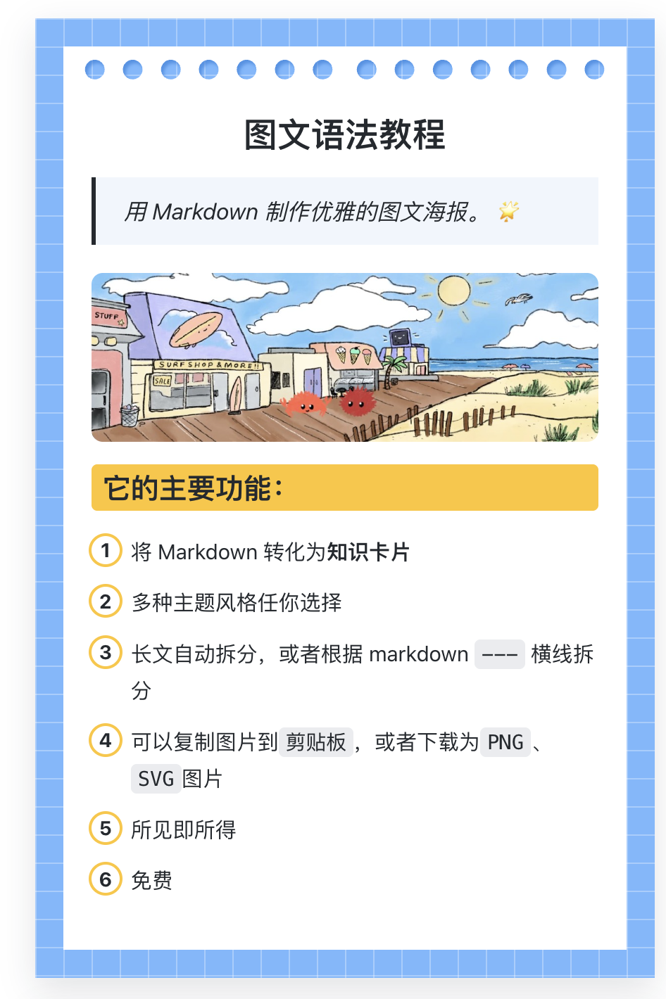
    </td>
    <td width="33%" align="center">
      
    </td>
  </tr>
</table>

<br />

<div align="center">
  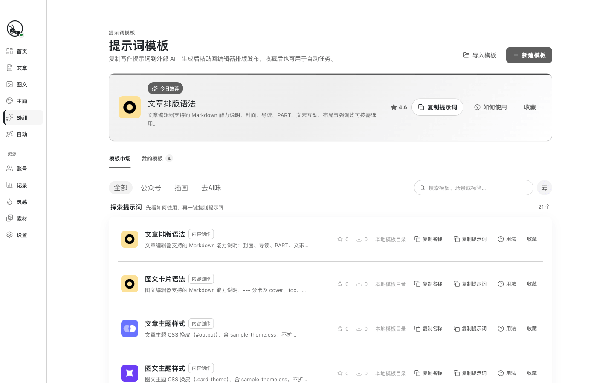
  <br /><sub>Skill 模板</sub>
</div>

<br />

<div align="center">
  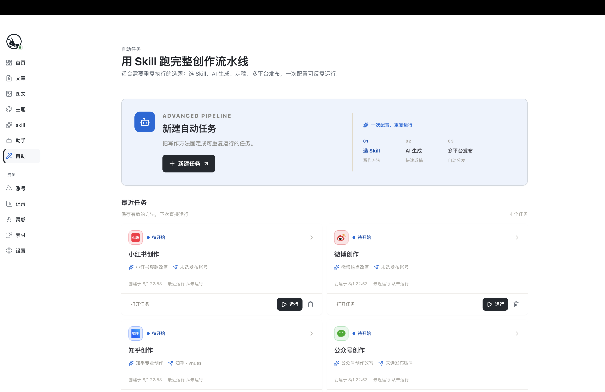
  <br /><sub>自动化任务</sub>
</div>

<br />

<div align="center">
  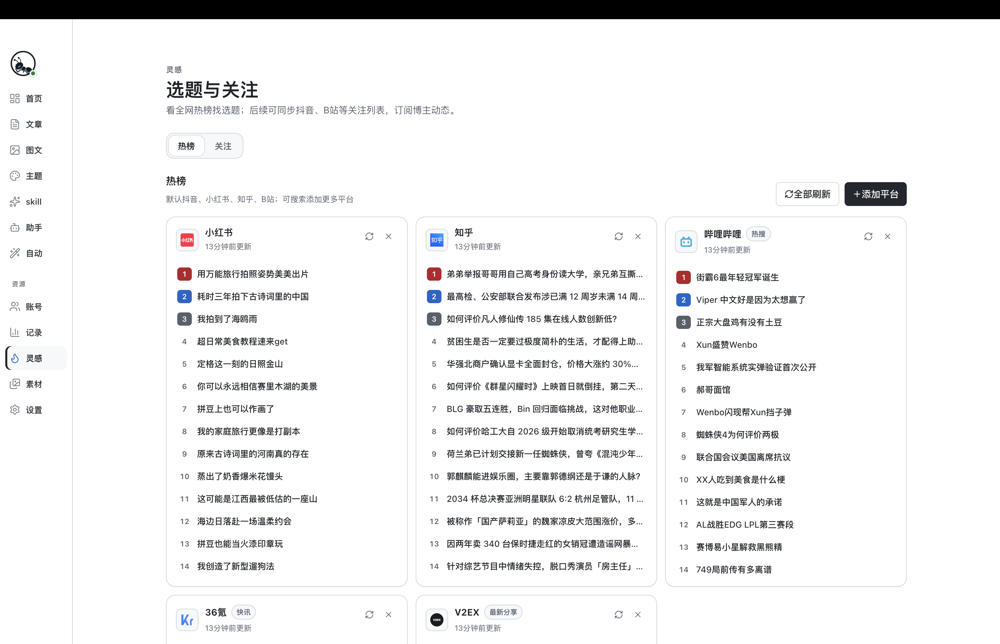
  <br /><sub>选题灵感</sub>
</div>

<br />

<div align="center">
  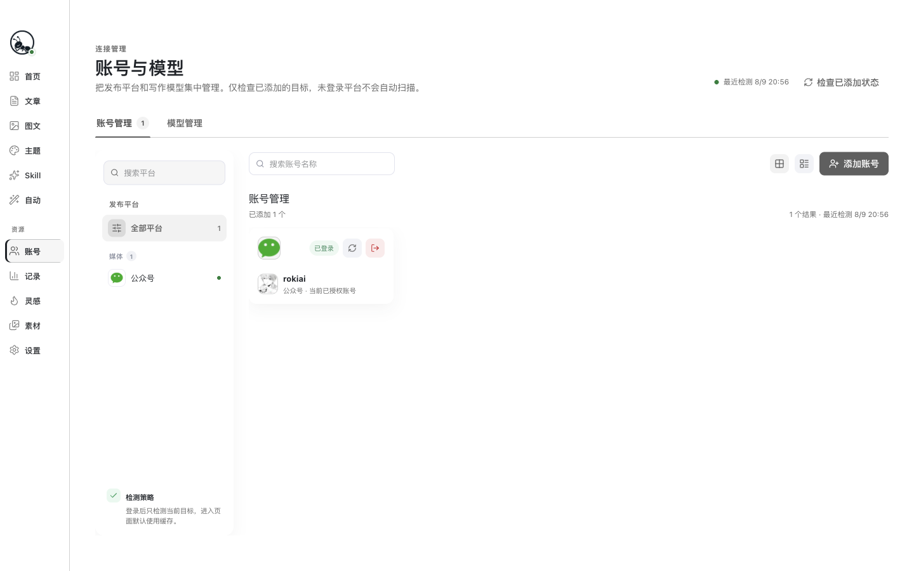
  <br /><sub>账号管理</sub>
</div>

---

## 功能一览

|                |                                                        |
| :------------- | :----------------------------------------------------- |
| **文章编辑**   | Markdown 长文稿，封面 / 目录 / 结构化排版，实时预览    |
| **图文编辑**   | Markdown 拆卡，机型预览，导出 PNG 或直接发布           |
| **主题库**     | 文章主题 + 图文主题，市场浏览、收藏、一键套用          |
| **Skill 模板** | 提示词市场与我的模板，写作方法可复用                   |
| **自动化**     | 选 Skill → AI 生成 → 多平台发布，配置一次反复跑        |
| **选题灵感**   | 多平台热榜聚合，快速找到值得写的题                     |
| **账号管理**   | 发布平台与写作模型，集中授权与登录态检测               |
| **MCP 接入**   | 供 Cursor、Codex 等外部 AI 客户端读写文稿、Skill、主题 |

## 快速上手

1. 打开应用，在「账号」里添加目标平台并完成登录
2. 在「模型」里授权写作用的 AI（如豆包、Kimi）
3. 从首页进入「发文章」或「做图文」，选主题、写内容、预览定稿
4. 点「发布」同步到平台草稿箱，或在「自动」里配置 Skill 流水线
5. （可选）在 Cursor 中配置 LazyAnt MCP，见下文 [MCP 接入](#mcp-接入cursor--codex--claude-desktop)

## MCP 接入（Cursor / Codex / Claude Desktop）

LazyAnt 自带 **MCP Server**，让 [Cursor](https://cursor.com)、[OpenAI Codex](https://developers.openai.com/codex)、Claude Desktop 等外部 AI 客户端直接读写你本地的文章、图文、Skill 与个人主题——与桌面端共用同一份数据，写完可在 LazyAnt 里预览、排版、发布。

### 能做什么

| 能力         | 新建 | 修改 | MCP 入口                                                                                                      |
| :----------- | :--: | :--: | :------------------------------------------------------------------------------------------------------------ |
| **规范**     |  —   |  —   | **Prompt** `写文章` 等（推荐）；或 Resource / `get_*_spec`                                                    |
| **文章**     |  ✅  |  ✅  | `get_article_draft` / `save_article_draft`                                                                    |
| **图文**     |  ✅  |  ✅  | `get_image_text_draft` / `save_image_text_draft`（`---` 分卡，至少 4 张卡）                                   |
| **Skill**    |  ✅  |  ✅  | `list_workspace_skills` / `get_skill_pack` / `save_workspace_skill` / `remove_workspace_skill`                |
| **文章主题** |  ✅  |  ✅  | `list_article_themes` / `get_article_theme` / `save_personal_article_theme` / `update_personal_article_theme` |
| **图文主题** |  ✅  |  ✅  | `list_image_themes` / `get_image_theme` / `save_personal_image_theme` / `update_personal_image_theme`         |

说明：

- 文章与图文定稿写入 `workspace/articles/article-ready.json`，打开 LazyAnt 编辑器即可看到。
- **写前先读规范**：优先用 MCP Prompt `写文章` 等；或 `get_*_spec` / Resource `lazyant://spec/...`。
- 个人主题写入 `workspace/themes/`，会自动同步到「我的主题」；市场内置主题可**浏览读取**，修改仅针对个人主题。
- 平台发布、登录态检测等**不**通过 MCP 暴露。

### 配置步骤（推荐：已安装 LazyAnt）

1. 打开 LazyAnt → **设置** → **自动化**
2. 按客户端点击 **「复制 Cursor 配置」** 或 **「复制 Codex 配置」**（已含本机 `userData` 路径与当前系统启动器）
3. 粘贴到对应客户端（见下方）
4. 重启客户端，确认 `lazyant` 服务已连接

#### Cursor / Claude Desktop

粘贴 JSON 到 **Cursor → Settings → MCP**，或项目 `.cursor/mcp.json` / Claude Desktop 的 `claude_desktop_config.json`。

macOS 安装包示例（路径以你复制的内容为准）：

```json
{
  "mcpServers": {
    "lazyant": {
      "command": "/Applications/LazyAnt.app/Contents/Resources/lazyant-mcp",
      "args": [],
      "env": {
        "LAZYANT_DATA_DIR": "/Users/你的用户名/Library/Application Support/LazyAnt"
      }
    }
  }
}
```

Windows 启动器为 `Resources\lazyant-mcp.cmd`；Linux 为 `resources/lazyant-mcp`。无需单独安装 Node / pnpm。

#### OpenAI Codex

Codex 使用 TOML，不是 JSON。点击 **「复制 Codex 配置」** 后追加到：

- 用户级：`~/.codex/config.toml`（全局生效）
- 或项目级：`.codex/config.toml`（需 trusted project）

macOS 安装包示例：

```toml
[mcp_servers.lazyant]
command = "/Applications/LazyAnt.app/Contents/Resources/lazyant-mcp"
args = []

[mcp_servers.lazyant.env]
LAZYANT_DATA_DIR = "/Users/你的用户名/Library/Application Support/LazyAnt"
```

也可用 Codex CLI 注册（`command` 后的 `--` 之后为启动器路径）：

```bash
codex mcp add lazyant -- /Applications/LazyAnt.app/Contents/Resources/lazyant-mcp
```

若 CLI 未写入 `LAZYANT_DATA_DIR`，请在 `config.toml` 的 `[mcp_servers.lazyant.env]` 中手动补上（与设置页复制内容一致）。

保存后重启 Codex / 新开 `codex` 会话，在工具列表中应能看到 `lazyant` 的 20 个工具。

### 从源码开发时

在仓库根目录（开发专用，需本机已装 pnpm）：

```bash
LAZYANT_DATA_DIR="$HOME/Library/Application Support/LazyAnt" \
  pnpm --filter @lazy-ant/desktop cli:mcp
```

**Cursor**（`.cursor/mcp.json`，开发态）：

```json
{
  "mcpServers": {
    "lazyant": {
      "command": "pnpm",
      "args": ["--dir", "/你的路径/lazy-ant/apps/desktop", "cli:mcp"],
      "env": {
        "LAZYANT_DATA_DIR": "/Users/你的用户名/Library/Application Support/LazyAnt"
      }
    }
  }
}
```

**Codex**（`~/.codex/config.toml`，开发态）：

```toml
[mcp_servers.lazyant]
command = "pnpm"
args = ["--dir", "/你的路径/lazy-ant/apps/desktop", "cli:mcp"]

[mcp_servers.lazyant.env]
LAZYANT_DATA_DIR = "/Users/你的用户名/Library/Application Support/LazyAnt"
```

已安装 LazyAnt 的正式用户请用设置页 **「复制 Cursor 配置」**（指向 `lazyant-mcp`，无需 Node / pnpm）。

### 使用示例

在 Cursor / Codex 里可以让 AI 调用工具，例如：

- 「用 `save_article_draft` 写一篇关于 LazyAnt 的公众号稿」
- 「读取当前图文定稿，把第三张卡改短一点再保存」
- 「新建一个 Skill，SKILL.md 里写小红书种草笔记结构」
- 「基于摸鱼绿主题风格，生成一套个人文章主题 CSS 并保存」

保存图文时，`content` 须用独立行的 `---` 分隔卡片，至少 4 张卡，`tags` 恰好 3 个话题（不要加 `#`）：

```json
{
  "title": "笔记标题",
  "digest": "八十到一百字摘要",
  "content": "开头钩子\n\n---\n\n经历分享\n\n---\n\n三个方法\n\n---\n\n结尾提问",
  "tags": ["效率工具", "职场干货", "个人成长"]
}
```

更完整的工具说明与数据路径见 [MCP Server 文档](./apps/desktop/docs/MCP-Server.md)。

## 支持的平台

掘金 · 微信公众号 · 知乎 · 语雀 · 百家号 · 小红书 · 微博 等（持续增加中）

## 安装说明

### macOS

1. 按芯片下载对应 DMG：[Apple Silicon](https://github.com/rokiai/lazy-ant-app/releases/latest/download/LazyAnt-arm64.dmg) · [Intel](https://github.com/rokiai/lazy-ant-app/releases/latest/download/LazyAnt-x64.dmg)
2. 打开 DMG，把 **LazyAnt** 拖进「应用程序」
3. 从「应用程序」启动

若提示「已损坏，无法打开」，在终端执行：

```bash
xattr -cr /Applications/LazyAnt.app
open /Applications/LazyAnt.app
```

若提示「无法验证开发者」：右键 App →「打开」→ 再点「打开」；或在「系统设置 → 隐私与安全性」中点「仍要打开」。

### Windows

1. 运行 [LazyAnt-setup.exe](https://github.com/rokiai/lazy-ant-app/releases/latest/download/LazyAnt-setup.exe)
2. 若出现 SmartScreen：点「更多信息」→「仍要运行」

### Linux

- **AppImage**：`chmod +x LazyAnt.AppImage && ./LazyAnt.AppImage`（[下载](https://github.com/rokiai/lazy-ant-app/releases/latest/download/LazyAnt.AppImage)）
- **deb**：`sudo dpkg -i lazyant_amd64.deb`（[下载](https://github.com/rokiai/lazy-ant-app/releases/latest/download/lazyant_amd64.deb)，缺依赖时再 `sudo apt -f install`）

## 免责声明

LazyAnt 源码与安装包**仅供学习、研究与技术交流**，由开发者**免费提供**，不收取软件使用费。你可在遵守本声明及相关开源协议的前提下阅读、本地运行与二次开发；**不得**将本软件或其修改版用于商业销售、收费分发、代运营转售、捆绑售卖等营利行为，亦不得冒用本项目名义收费或提供付费「官方」服务（除非获得权利人书面授权）。

LazyAnt 仍处于快速迭代阶段，按「现状」提供，不构成任何明示或默示的保证。使用前请知悉并自行承担相关风险：

1. **开源与学习用途**：本仓库旨在分享桌面端内容工具的实现思路，不承诺长期维护、技术支持或功能完备。Fork、借鉴请自行评估合规性与维护成本；市场内置 Skill、主题等资源可能含第三方或上游许可，二次分发时请一并遵守其版权与许可条款。
2. **软件稳定性**：功能、界面、数据格式可能随版本更新发生变化；请勿将本软件作为唯一或关键业务数据的唯一存储与备份手段，重要内容请自行留存副本。
3. **AI 生成内容**：助手、Skill、自动化等能力依赖第三方大模型，生成结果可能存在事实错误、偏见或不适用场景。发布前请自行审核内容的准确性、合法性与合规性；因使用 AI 产出内容引发的纠纷或损失，由使用者自行负责。
4. **平台发布与账号**：本软件与各内容平台无官方关联；平台名称、标识等归各自权利人所有。同步草稿、自动发布等能力依赖各平台页面与接口，可能因平台规则调整、风控、登录态失效而失败或受限。请遵守各各平台服务条款与社区规范；因违规使用导致的限流、封禁或其他后果，由使用者自行承担。
5. **数据与凭证**：账号登录态、API Key、本地文稿等数据主要保存在你的设备上。请妥善保管设备与密钥，勿在不可信环境使用；因泄露、误操作或第三方服务中断造成的损失，开发者不承担赔偿责任。
6. **责任限制**：在适用法律允许的最大范围内，开发者不对因使用或无法使用本软件而产生的任何直接、间接、附带或后果性损害承担责任。

继续使用、下载或基于本仓库进行二次开发，即表示你已阅读并理解上述条款。若不同意，请停止使用并卸载本软件。
